# Qualys QScanner for AWS CodeBuild: Technical Architecture

Technical architecture documentation for the Qualys QScanner integration with AWS CodeBuild.

## Architecture Overview

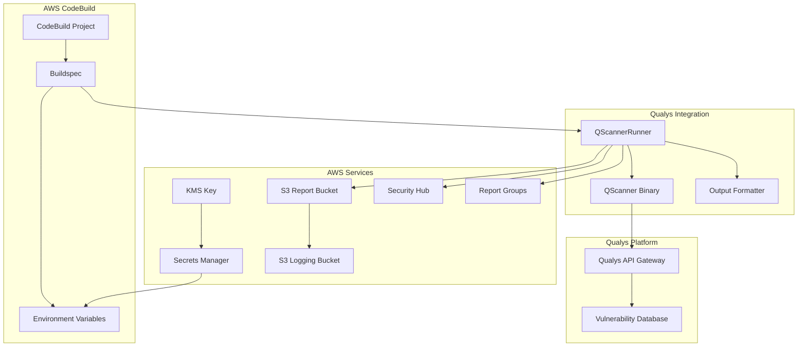

## Component Architecture

### QScannerRunner

The core component responsible for binary management and scan orchestration.

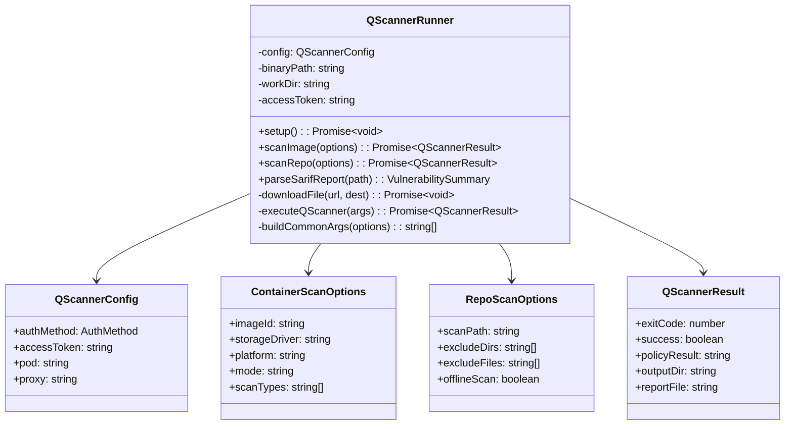

## Scan Execution Flow

### Container Scan Flow

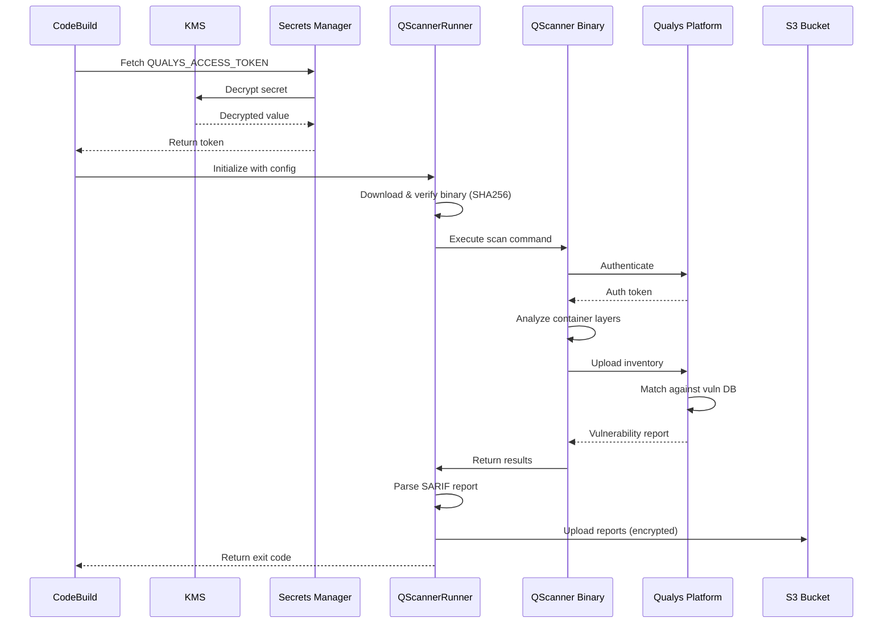

### Code Scan Flow

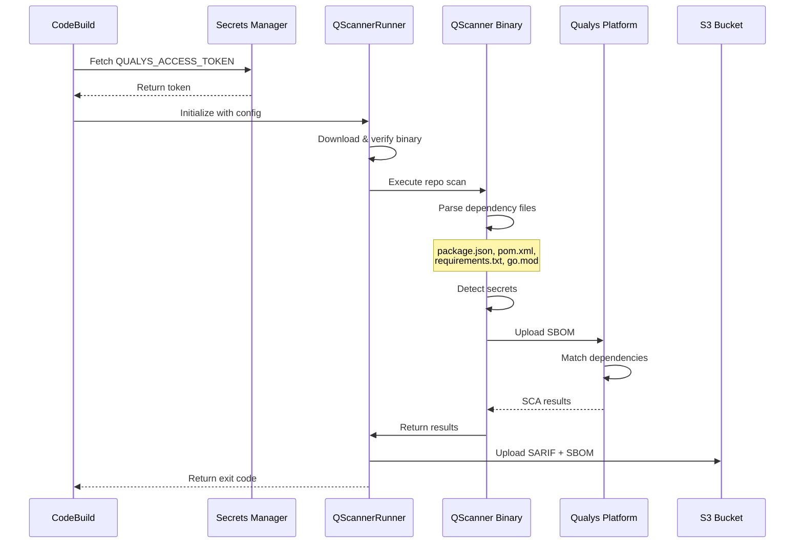

## Binary Management

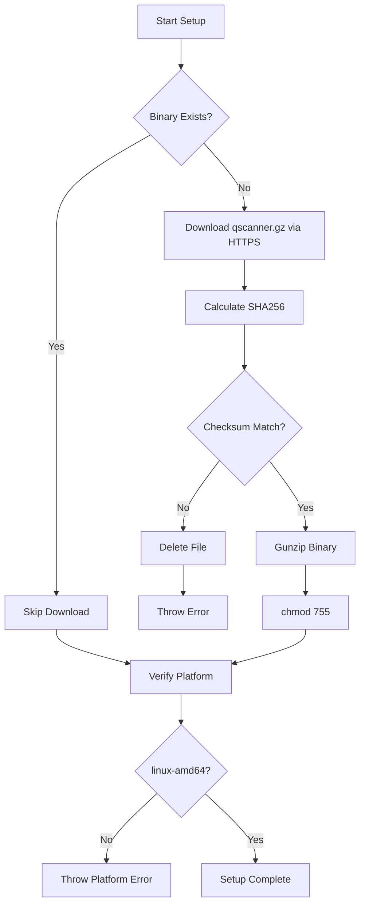

## CloudFormation Resource Architecture

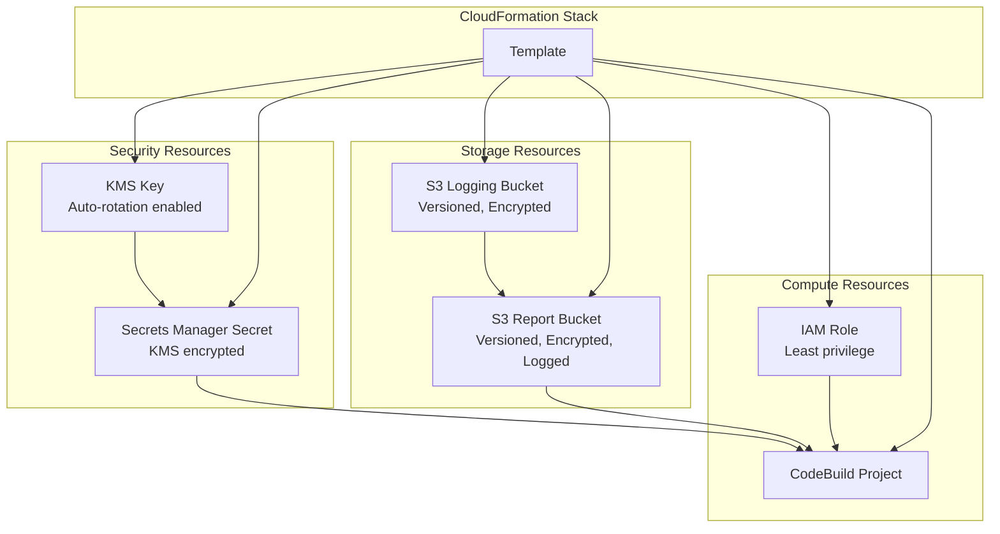

## Security Architecture

### Encryption at Rest

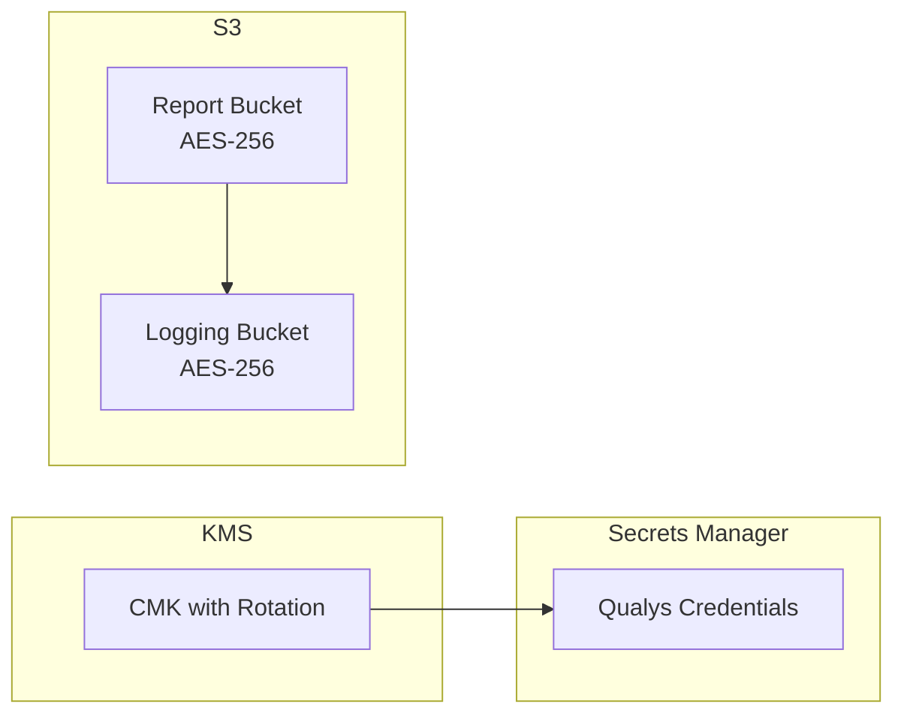

### IAM Permission Boundaries

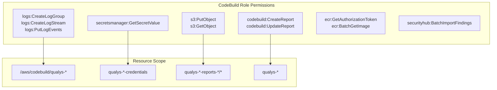

## Multi-Region Deployment (StackSets)

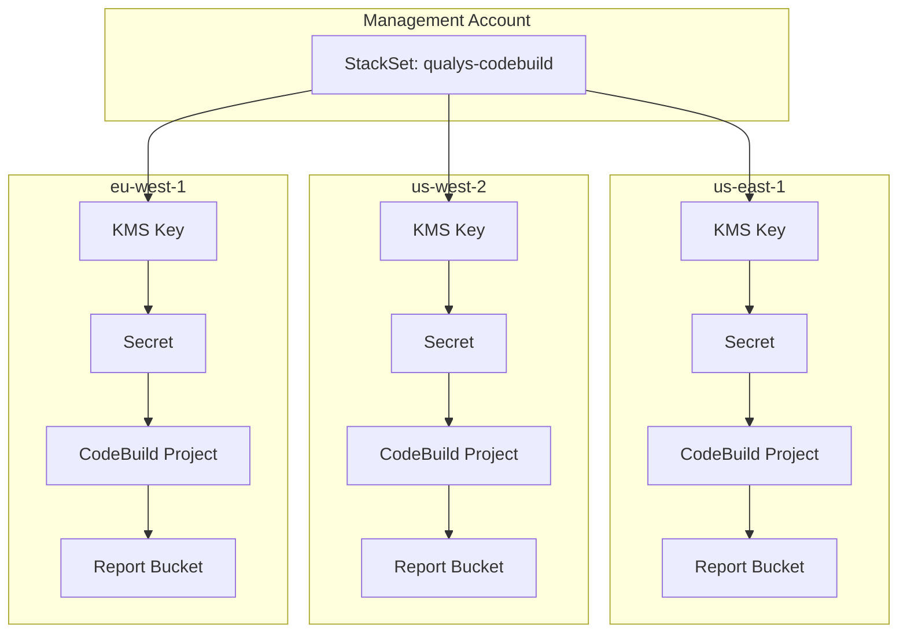

Each region receives:
- Independent KMS key with rotation
- Region-specific Secrets Manager secret
- Dedicated S3 buckets (reports + logging)
- CodeBuild project named `qualys-codebuild-{type}-{region}`

## Security Hub Integration

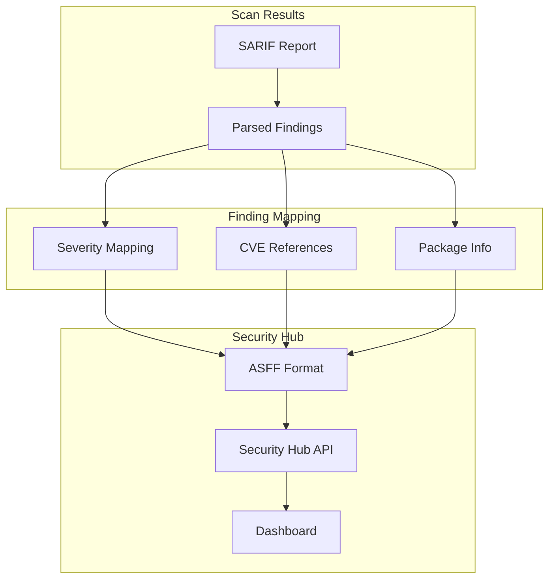

### Severity Mapping

| Qualys Severity | Security Hub Label | Normalized Score |
|-----------------|-------------------|------------------|
| 5 (Critical) | CRITICAL | 90 |
| 4 (High) | HIGH | 70 |
| 3 (Medium) | MEDIUM | 40 |
| 2 (Low) | LOW | 20 |
| 1 (Info) | INFORMATIONAL | 0 |

## Exit Code Flow

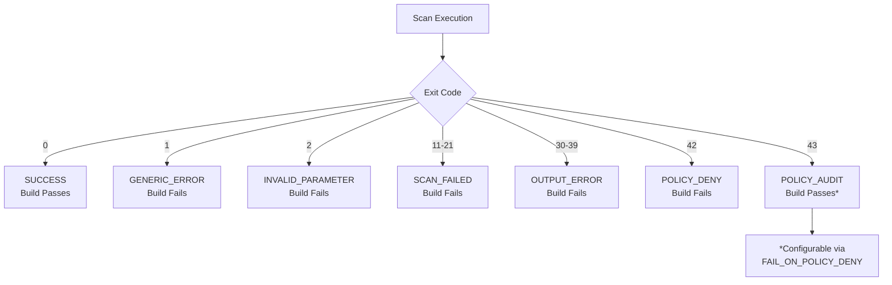

## Threshold Evaluation

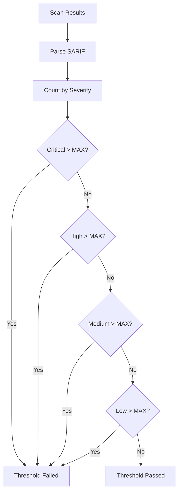

## Deployment Patterns

### Single Account

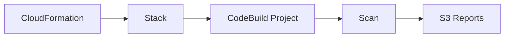

### Multi-Account via StackSets

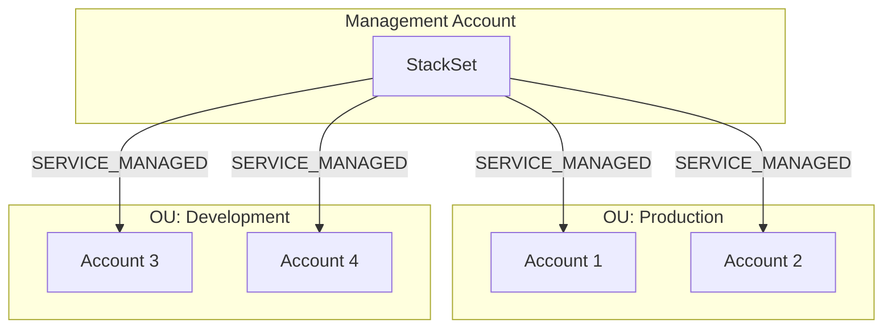

### CodePipeline Integration

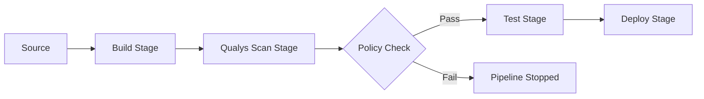

## Supported Languages (Code Scanning)

| Language | Dependency Files |
|----------|-----------------|
| JavaScript/TypeScript | package.json, package-lock.json, yarn.lock |
| Python | requirements.txt, Pipfile, setup.py |
| Java/Kotlin | pom.xml, build.gradle |
| Go | go.mod, go.sum |
| Rust | Cargo.toml, Cargo.lock |
| .NET | *.csproj, packages.config |
| Ruby | Gemfile, Gemfile.lock |
| PHP | composer.json, composer.lock |

## Troubleshooting

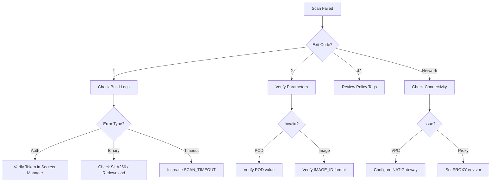

## Related Documentation

- [README.md](../README.md) - Quick start and configuration
- [Qualys Container Security User Guide](https://www.qualys.com/docs/qualys-container-security-user-guide.pdf)
- [AWS CodeBuild Documentation](https://docs.aws.amazon.com/codebuild/latest/userguide/welcome.html)
- [AWS StackSets Documentation](https://docs.aws.amazon.com/AWSCloudFormation/latest/UserGuide/what-is-cfnstacksets.html)
