# Qualys QScanner for AWS CodeBuild: Technical Architecture

This document provides a deep dive into the technical architecture of the Qualys QScanner integration for AWS CodeBuild, including component interactions, data flows, and deployment patterns.

## Architecture Overview

The integration provides seamless vulnerability scanning within AWS CodeBuild pipelines, leveraging native AWS services for credential management, report storage, and event-driven notifications.

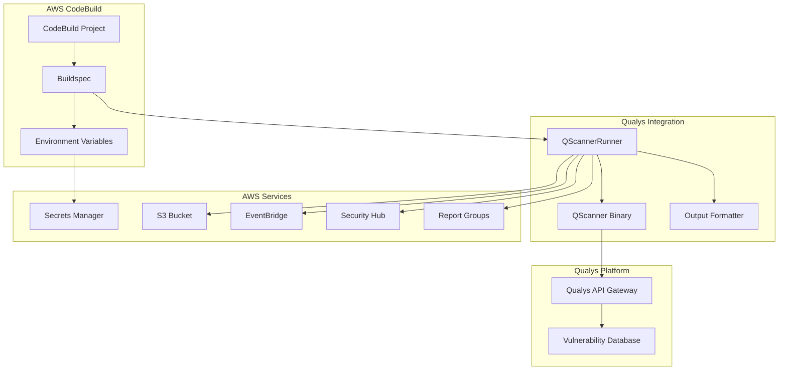

## Component Architecture

### QScannerRunner

The core component responsible for binary management and scan orchestration.

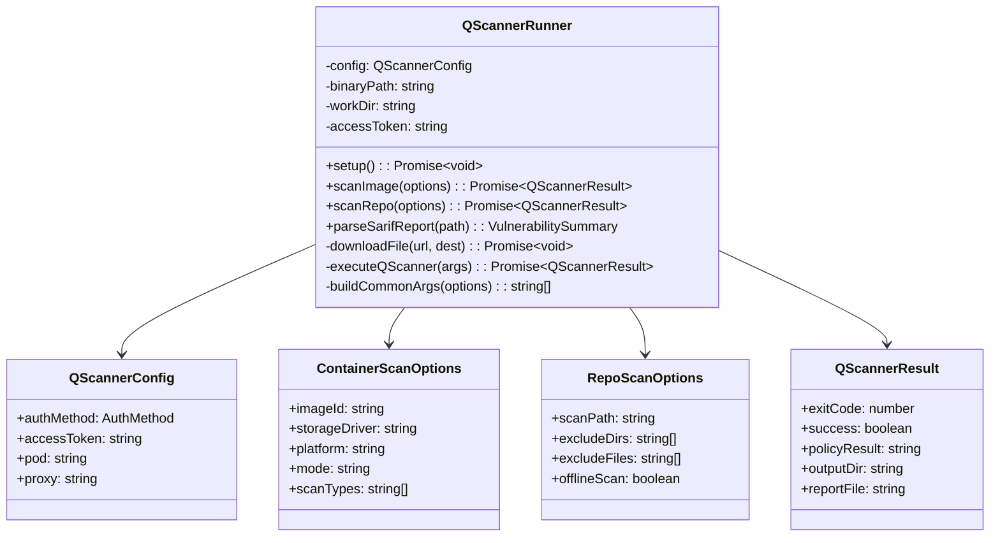

## Scan Execution Flow

### Container Scan Flow

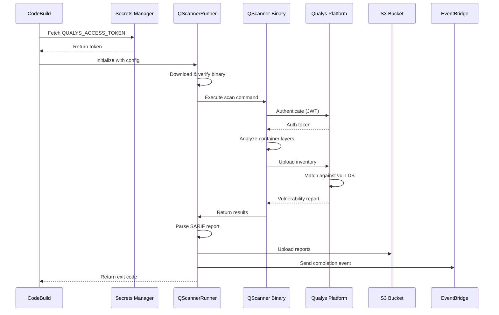

### Code Scan Flow

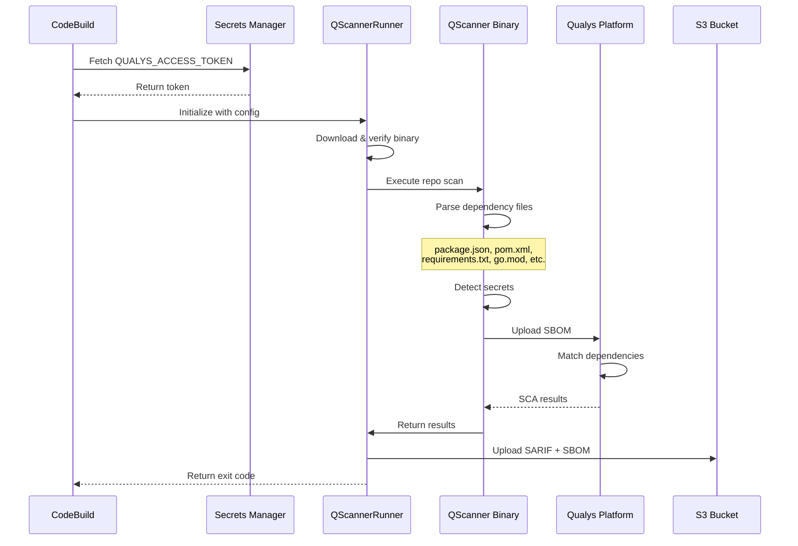

## Binary Management

The binary download and verification process ensures integrity and security.

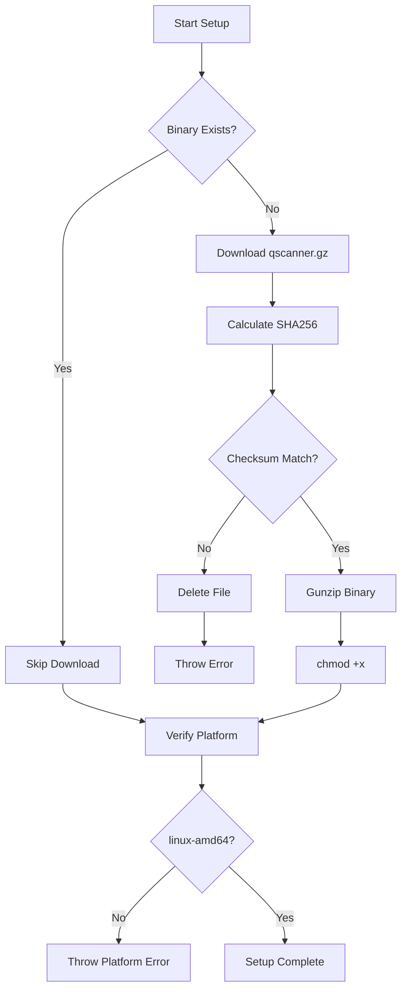

## AWS Integration Architecture

### Secrets Manager Integration

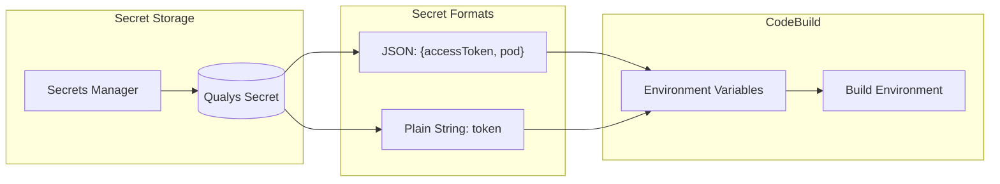

### S3 Report Storage

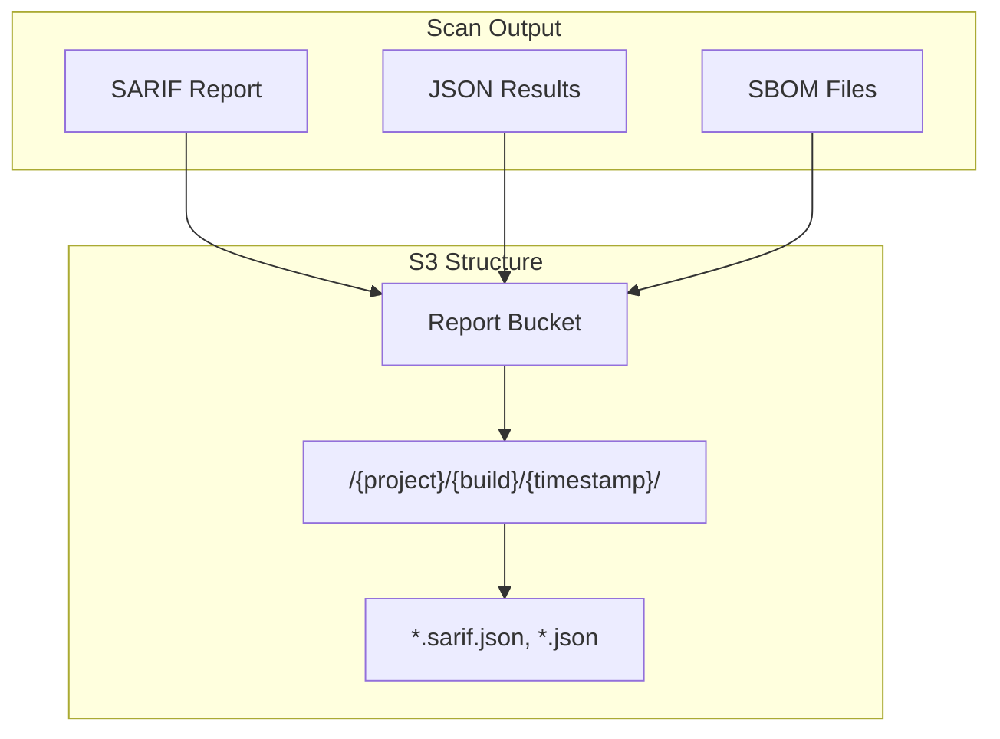

### EventBridge Integration

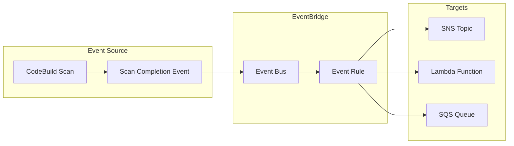

### Security Hub Integration

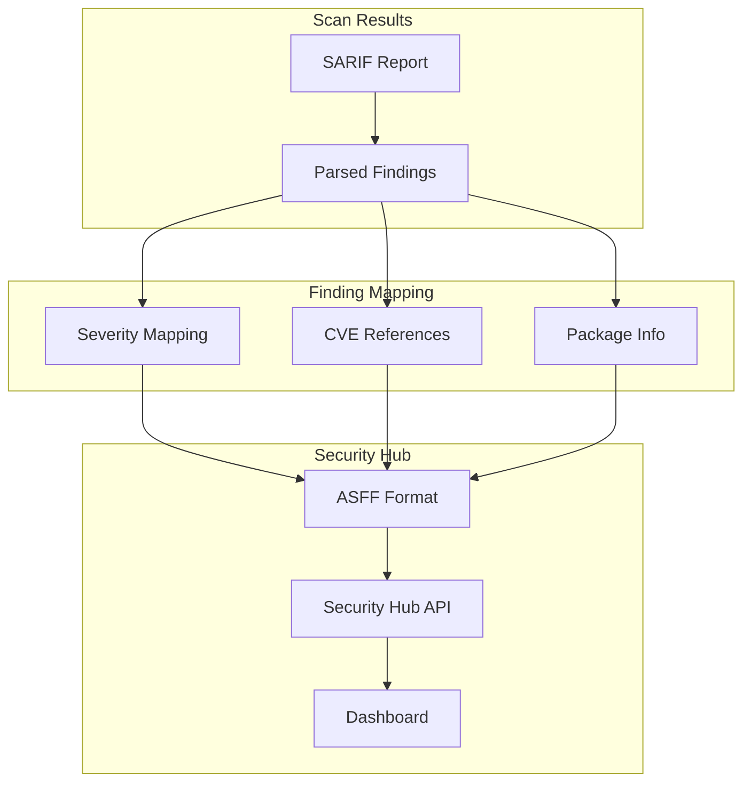

Security Hub finding mapping:

| Qualys Severity | Security Hub Label | Normalized Score |
|-----------------|-------------------|------------------|
| 5 (Critical) | CRITICAL | 90 |
| 4 (High) | HIGH | 70 |
| 3 (Medium) | MEDIUM | 40 |
| 2 (Low) | LOW | 20 |
| 1 (Info) | INFORMATIONAL | 0 |

## CloudFormation Deployment Architecture

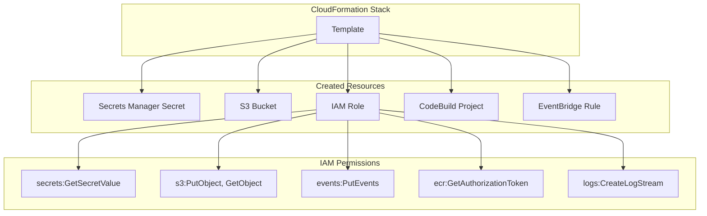

## Scan Types and Capabilities

### Container Scanning

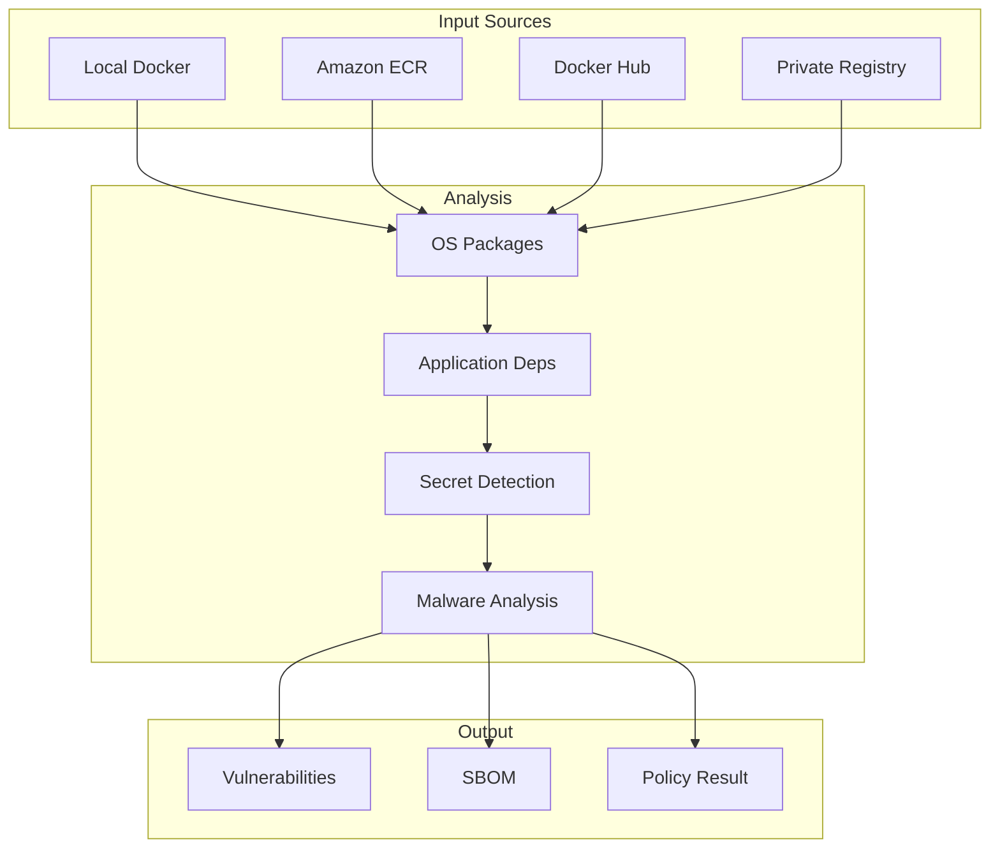

### Code/SCA Scanning

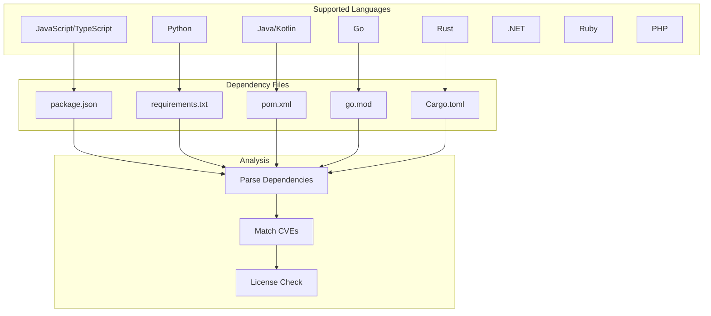

## Exit Code Flow

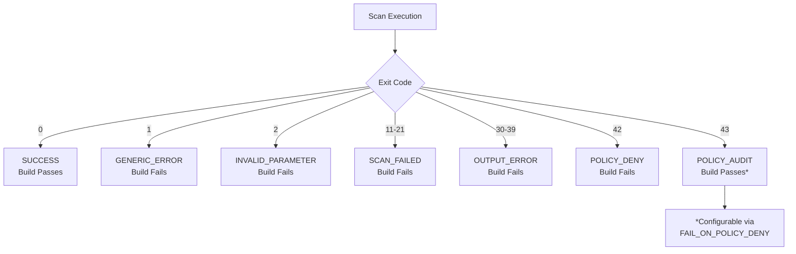

## Threshold Evaluation

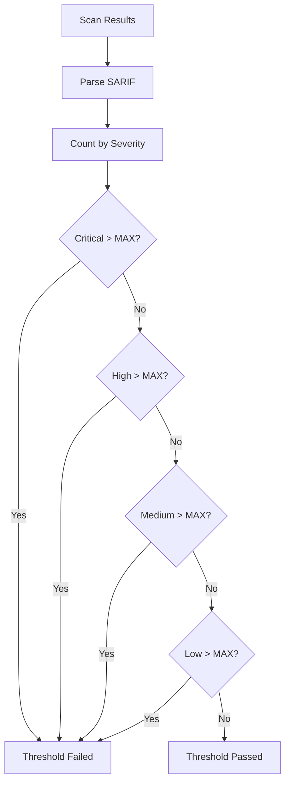

## Security Considerations

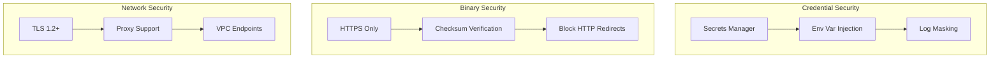

## Deployment Patterns

### Single Project Pattern

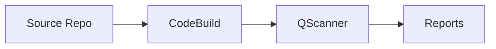

### Pipeline Integration Pattern

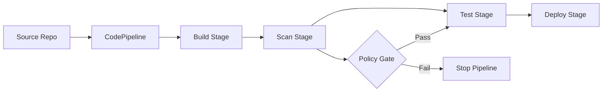

### Multi-Account Pattern

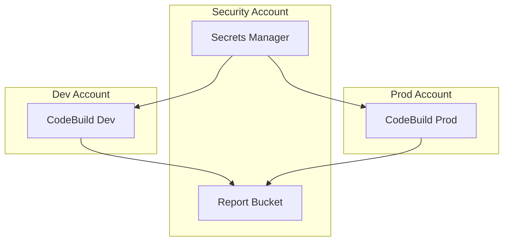

## Performance Considerations

| Operation | Typical Duration |
|-----------|-----------------|
| Binary Download | 5-10 seconds |
| Container Scan (small image) | 30-60 seconds |
| Container Scan (large image) | 2-5 minutes |
| Code Scan (small repo) | 10-30 seconds |
| Code Scan (large repo) | 1-3 minutes |
| S3 Upload | 1-5 seconds |

## Troubleshooting Decision Tree

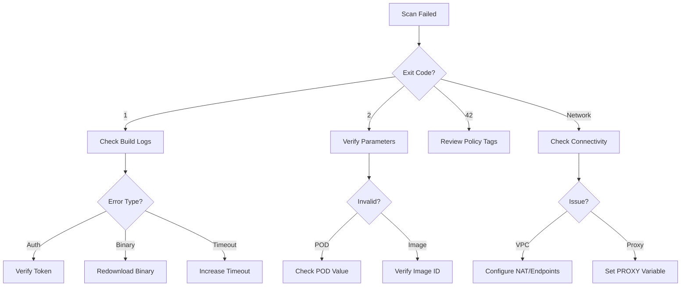

## Related Documentation

- [README.md](../README.md) - Quick start and configuration reference
- [Qualys QScanner Documentation](https://www.qualys.com/docs/qualys-container-security-user-guide.pdf)
- [AWS CodeBuild Documentation](https://docs.aws.amazon.com/codebuild/latest/userguide/welcome.html)
